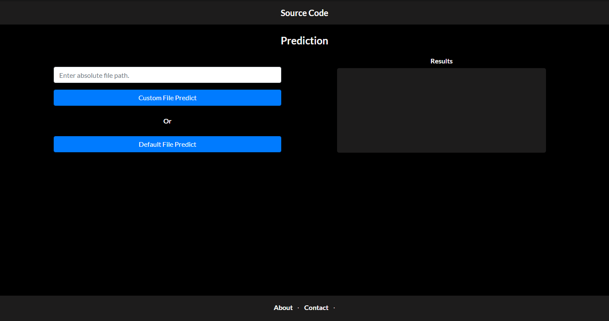

# Cement-Strength-Prediction

I have made this Project to predict the strength of **Cement**. \
The project takes in multiple csv files as input and first classifies them into good or bad files (according to schema), then predicts the result.\
The project follows a very structural approach and uses Flask Framework that provides a very intuitive UI. The Inputs are taken in the form of a .csv file and the Prediction file is also created in a .csv format.\
This app can be easily deployed on Heroku (deployment details are given below).
<br><br>

## Screenshot<br>



<br>

## Features

- Responsive Web App
- Logs each action
- Supports Every Operating System and Browser

<br>

## Tech Stack

**Client:** HTML, CSS and Bootstrap

**Server:** Python

<br>

## Installation

Install dependencies for the project using _**pip**_

```bash
    cd <project-folder>
    pip install -r requirements.txt
```
<br>

## Deployment

Project can be deployled on Heroku

```bash
  git add .
  git commit -m <message>
  heroku login
  heroku create <app-name>
  git push heroku <branch-name>
```
Refer to the official documentation for more details: https://devcenter.heroku.com/articles/getting-started-with-python

<br>  

## License

[MIT](https://choosealicense.com/licenses/mit/)
<br>
  
## Author

[@Rishabh1501](https://github.com/Rishabh1501)
<br>

## Support

For support, email at rishabhkalra1501@gmail.com 
